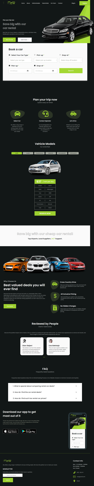

# About the project

A car rental website is an online platform that allows users to rent cars for personal or business use. The website provides an interface for searching, comparing, and reserving cars.

👉 Live Demo: <a href="https://rentiranjeautomobila.netlify.app/">Live Demo</a>

## Build with:
➡ React JS
➡ Sass / Scss

## Screenshots of the Project 📸

;